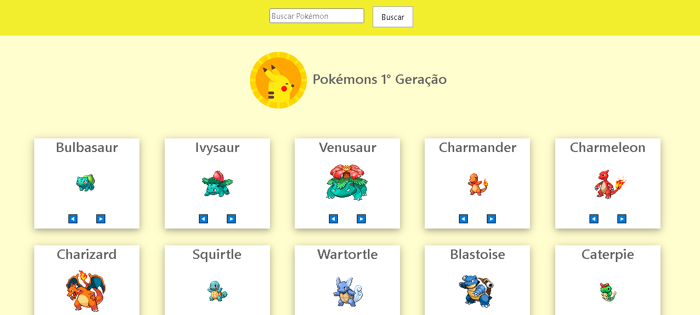
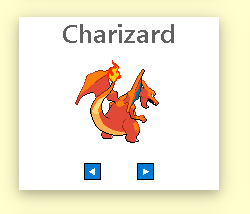
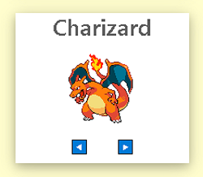
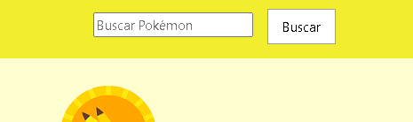
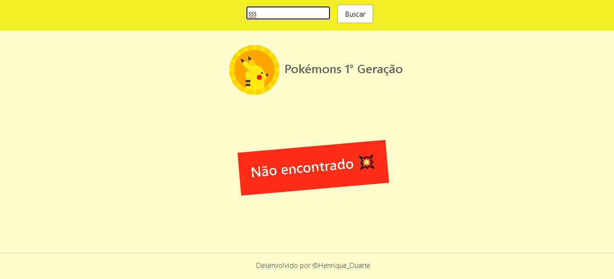

<h1>Pokemons 1° Geração</h1>

<h2> Instalação local</h2>

Dentro do diretorio, Deve ser feito a instalação das dependencias com o seguinte comando:

<i>- npm install;</i>

<h2>Iniciando servidor</h2>

Após isso, para iniciar, dentro do diretorio raiz, deve ser executado o seguinte comando:

<i>- npm run serve;</i>

<h2> Orientações </h2>

- Por padrão, a aplicação estará configurada para escutar a porta 8080, para altera-la, executar o seguinte comando: 
 

<i>- npm run serve -- --port "PORTA DESEJADA"</i>

<i>- Esta sendo feito uma chamada Get para retorno de 151 itens, podendo ser alterada conforme demanda;</i>

- Ao iniciar no navegador com as URL Local: http://localhost:8080/ ou Network: http://192.168.1.6:8080/, sera apresentado a pagina para visualizar os Pokemons, onde é possivel pesquisar pelo nome e trocar o sprite de cada Pokemon;

- Para trocar o sprite, basta clicar nas setas dentro do card:

 

- Para pesquisar, basta ir no campo "Buscar pokemon", deve ser digitado em letras minusculas e ir na opção "Buscar":

- Para apresentar todos, deve clicar no botão "Buscar" com o campo em branco, para que seja apresentado todos os cards novamente;

- Caso o Pokemon pesquisado não exista, sera apresentado a mensagem "Não encontrado":

<i> Projeto para demonstar um projeto SPA consumindo a API https://pokeapi.co/api/v2/ em constante mudança;</i>

